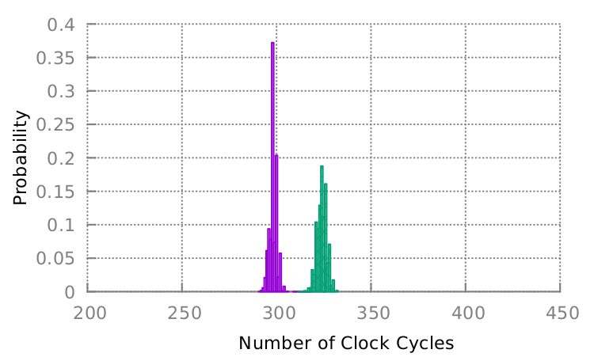

# SpectreRewind-PoC

This repository contains a PoC for demonstrating the SpectreRewind attack.

## Prerequisites

Running the PoC itself doesn't have any dependencies, but to plot the results gnuplot needs to be installed. 

On Ubuntu-based systems, this can be done with:

	$ sudo apt install gnuplot

## Demo - detect-spr

To run a SpectreRewind attack and plot the results, the following commands should be run:

	$ make
	$ ./detect_spr 2> hist.dat
	$ gnuplot plot.gnu > hist.pdf

Below is the histogram showing the results on our machine.



	
If necessary, the x-axis range of the graph can be changed by modifying line 26 in plot.gnu:

	set xrange [200:450]

Replace 200 and 450 to set new lower and upper bounds for the x-axis, respectively.


## Citation

The paper for SpectreRewind can be found [here](http://www.ittc.ku.edu/~heechul/papers/spectrerewind-ashes2020-camera.pdf). 
Please use the following BibTex entry for citation:

```
@inproceedings{fustos2020spectrerewind,
  title={SpectreRewind: Leaking Secrets to Past Instructions},
  author={Fustos, Jacob and Bechtel, Michael and Yun, Heechul},
  booktitle={Proceedings of the 4th ACM Workshop on Attacks and Solutions in Hardware Security},
  pages={117--126},
  year={2020}
}
```
